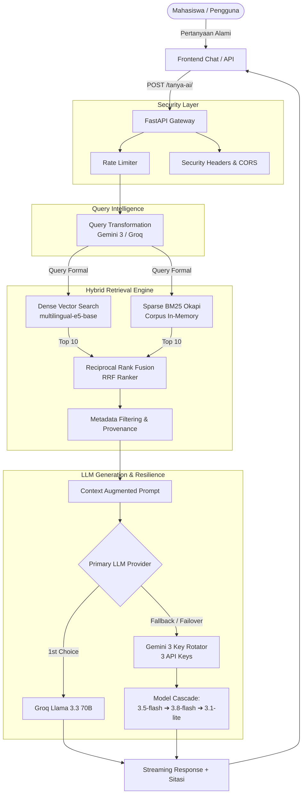

# 🎓 Chatbot RAG Kampus Universitas Gunadarma v2.0

[](https://fastapi.tiangolo.com)
[](https://python.org)
[](https://langchain.com)
[](https://trychroma.com)
[](https://groq.com)
[](https://aistudio.google.com)

Sistem Chatbot Akademik berbasis **Retrieval-Augmented Generation (RAG)** cerdas untuk lingkungan kampus Universitas Gunadarma. Sistem ini mampu menjawab pertanyaan mahasiswa terkait jadwal kuliah, dosen wali/pembimbing, RPS, kalender akademik, dan prosedur administrasi secara cepat, akurat, dan transparan.

> **Catatan Akademik & Asal Usul Proyek:**  
> Proyek ini dikembangkan dan dimodernisasi dari penelitian tugas akhir / skripsi oleh **Muhammad Thufeil Putrayama (NPM: 11122006)**. Versi 2.0 ini menyempurnakan kelemahan arsitektur dasar dengan mengimplementasikan evaluasi komprehensif terkait *Ablation Study* dan benchmark *retrieval* eksplisit.

---

## 🚀 Live Demo & Panduan Uji Coba Cepat

Anda dapat langsung mencoba chatbot ini secara interaktif:

### 🔗 Link Demo Online:
👉 **[Buka Demo Chatbot Gunadarma di Hugging Face Spaces](https://huggingface.co/spaces/REXYM/chatbot-rag-gunadarma)**  
*(Host di Hugging Face Spaces — Siap Digunakan Langsung via Browser)*

### 💬 Contoh Pertanyaan untuk Menguji Sistem:
Coba tanyakan berbagai topik berikut untuk melihat kemampuan pencarian hybrid dan kecerdasan AI:

| Kategori Pengujian | Contoh Pertanyaan Uji Coba | Yang Perlu Diperhatikan |
|---|---|---|
| 📅 **Jadwal Kuliah** | *"Jadwal kuliah untuk kelas 3IA01 hari apa dan jam berapa?"* | Akurasi pencarian kode kelas spesifik |
| 👨‍🏫 **Dosen Wali** | *"Siapa dosen wali untuk kelas 1KA01?"* | Ketepatan ekstraksi nama dosen |
| 📝 **Dosen Pembimbing PI** | *"Dosen pembimbing PI kelas 4KA27 siapa?"* | Pencarian data bimbingan mahasiswa |
| 📚 **Kurikulum & RPS** | *"Mata kuliah semester 5 untuk jurusan Sistem Informasi apa saja?"* | Filter metadata berbasis program studi |
| 🏛️ **Administrasi Kampus** | *"Bagaimana alur pengurusan ujian yang bentrok?"* | Penjelasan langkah-langkah prosedural resmi |

> 💡 **Fitur Transparansi Sumber:**  
> Di akhir setiap jawaban, bot akan menyematkan **Badge Sitasi Sumber** resmi (misal: `[Sumber: Jadwal Kuliah Master, Daftar Dosen Kelas]`), membuktikan informasi bersumber dari data kampus yang valid (anti-halusinasi).

---

## 🌟 Apa yang Baru di Versi 2.0 (Upgrade vs Versi Asli)

| Dimensi | 🏛️ Versi Skripsi Asli (v1.0) | 🚀 Versi Upgraded (v2.0) |
| :--- | :--- | :--- |
| **Metode Pencarian Dokumen** | Dense Vector Search murni + regex hardcoded manual | **Hybrid Search**: BM25 Okapi (Sparse) + Dense Vector (`multilingual-e5-base`) + **Reciprocal Rank Fusion (RRF)** |
| **Mekanisme Indexing** | Rebuild total dari nol (`reset_vectordb` hapus folder) | **Incremental Indexing**: berbasis MD5 manifest hash, hanya memproses dokumen baru/berubah |
| **Chunking & Metadata** | Chunking statis 1.000 karakter tanpa metadata | **Metadata-Aware Chunking**: otomatis mendeteksi kategori (jadwal, dosen, rps) & prodi (SI, TI, dll.) |
| **Transparansi Sumber** | Dilarang menyebutkan sumber dokumen | **Source Citation**: Badge sitasi dokumen resmi (`[Sumber: ...]`) di bubble chat |
| **Ketahanan LLM (Resilience)** | Single API key (mudah error 429 quota habis) | **Rotasi 3 API Key Gemini** + **Cascade Model Fallback** + **Dual-Provider Failover (Groq ↔ Gemini 3)** |
| **Keamanan Password** | Plain-text di `.env` | **Bcrypt Salted Hash (12 rounds)** |
| **Otentikasi Admin** | Sesi sederhana rentan replay | **Stateless JWT (HS256)** 8 jam + unique `jti` + in-memory revocation blacklist |
| **Perlindungan Serangan** | Tidak ada batasan request | **Rate Limiting (SlowAPI)** per-IP, anti brute-force timing (`secrets.compare_digest`), HTTP Security Headers |
| **Evaluasi Akademik** | Pengujian fungsionalitas umum | **Ablation Study Kuantitatif 4 Skenario × 30 Kasus Uji** (Hit Rate, MRR, Context Precision, Latency) |
| **Observability** | Tidak ada monitoring | Endpoint `/health` dengan tracking **Latency percentiles (p50, p95, p99)** real-time |

---

## 📊 Hasil Ablation Study (Evaluasi Kuantitatif)

Dilakukan pengujian *ablation* 4 skenario pada 30 *ground-truth test cases* untuk mengukur kontribusi masing-masing komponen retrieval:

| Skenario | Hit Rate@5 | MRR (Mean Reciprocal Rank) | Context Precision | Rata-rata Latency |
| :--- | :---: | :---: | :---: | :---: |
| 1. Raw Query + Dense | 63.3% | 0.522 | 33.3% | 208 ms |
| 2. Transformed Query + Dense | 73.3% | 0.622 | 34.7% | 176 ms |
| 3. Raw Query + Hybrid | 76.7% | 0.584 | 30.7% | 180 ms |
| **4. Transformed Query + Hybrid (Aktif)** | **76.7%** | **0.644** | **33.3%** | **175 ms** |

> **Temuan Kunci:**  
> - Peningkatan **+13.4 poin** pada Hit Rate@5 dari konfigurasi baseline ke konfigurasi hybrid akhir.  
> - Nilai MRR tertinggi **(0.644)** diraih oleh Transformed Query + Hybrid, membuktikan dokumen relevan ditempatkan pada peringkat teratas secara konsisten.  
> - Visualisasi lengkap 7 grafik tersedia di file `ablation_results.png`.

---

## 🏗️ Arsitektur Sistem



---

## ⚙️ Persyaratan Sistem

- Python 3.10 atau 3.11
- Pip package manager
- Koneksi internet (untuk download model embedding pertama kali & panggilan API LLM)

---

## 🚀 Panduan Menjalankan Secara Lokal

### 1. Clone Repositori
```bash
git clone https://github.com/username/project-chatbot.git
cd project-chatbot
```

### 2. Buat Virtual Environment & Install Dependensi
```bash
python -m venv venv
# Windows:
venv\Scripts\activate
# Linux/Mac:
source venv/bin/activate

pip install -r requirements.txt
```

### 3. Konfigurasi File `.env`
Salin template konfigurasi:
```bash
copy .env.example .env
```
Isi API key yang Anda miliki di `.env`:
- `GROQ_API_KEY`: Dapatkan gratis di [console.groq.com](https://console.groq.com)
- `GEMINI_API_KEY_1`, `GEMINI_API_KEY_2`, `GEMINI_API_KEY_3`: Dapatkan gratis di [Google AI Studio](https://aistudio.google.com)

### 4. Jalankan Server
```bash
uvicorn app:app --reload --port 8000
```
Buka browser:
- Tampilan Mahasiswa: `http://localhost:8000`
- Dashboard Admin: `http://localhost:8000/admin.html`
- Health & Latency Metrics: `http://localhost:8000/health`
- Swagger API Docs: `http://localhost:8000/docs`

---

## 🌐 Panduan Deploy Publik 100% GRATIS

Sistem ini didesain agar dapat di-deploy ke platform cloud gratis tanpa memerlukan kartu kredit:

### Opsi A: Hugging Face Spaces (Sangat Direkomendasikan - 16 GB RAM Gratis)
1. Buka [Hugging Face Spaces](https://huggingface.co/spaces) dan buat Space baru.
2. Pilih Space SDK: **Docker** (Blank).
3. Connect dengan repository GitHub ini atau push langsung.
4. Masukkan environment variable (`GROQ_API_KEY`, `GEMINI_API_KEY_1`, dst.) di menu **Settings ➔ Variables and secrets**.
5. Aplikasi akan langsung aktif dengan domain publik gratis `https://username-space.hf.space`.

### Opsi B: Render.com (Free Web Service)
1. Buka [Render.com](https://render.com) dan buat akun (gratis tanpa kartu kredit).
2. Buat **New Web Service** dan hubungkan ke repo GitHub Anda.
3. Render akan otomatis mendeteksi konfigurasi `render.yaml` atau isi:
   - **Build Command**: `pip install -r requirements.txt`
   - **Start Command**: `uvicorn app:app --host 0.0.0.0 --port $PORT`
4. Tambahkan secret environment variables di dashboard Render.
5. Selesai! Web service aktif di `https://chatbot-rag-xxxx.onrender.com`.

---

## 📁 Struktur Direktori

```text
├── app.py                      # Core FastAPI Application & Routing
├── rag.py                      # RAG Engine v2.0 (Hybrid Search, Incremental, Citation)
├── requirements.txt            # Dependensi Python
├── index.html                  # Frontend Chat Interface (Mahasiswa)
├── admin.html                  # Frontend Dashboard Pengelolaan Data (Admin)
├── .env.example                # Template konfigurasi environment
├── .gitignore                  # Filter keamanan & cache
├── Procfile                    # Runner command untuk cloud PaaS
├── render.yaml                 # Blueprint deployment Render
├── Dockerfile                  # Container definition untuk Docker / HF Spaces
├── data preprocessing/         # Dataset dokumen akademik kampus (.txt)
├── ablation_study.py           # Benchmark script 4 skenario × 30 test cases
├── visualisasi_ablation.py     # Generator visualisasi grafik ilmiah
├── ablation_results.json       # Hasil mentah evaluasi eksperimen
└── ablation_results.png        # Grafik komparatif publikasi ilmiah
```

---

## 📄 Lisensi & Hak Cipta
Hak Cipta © 2026. Dikembangkan untuk keperluan riset akademik Universitas Gunadarma.
